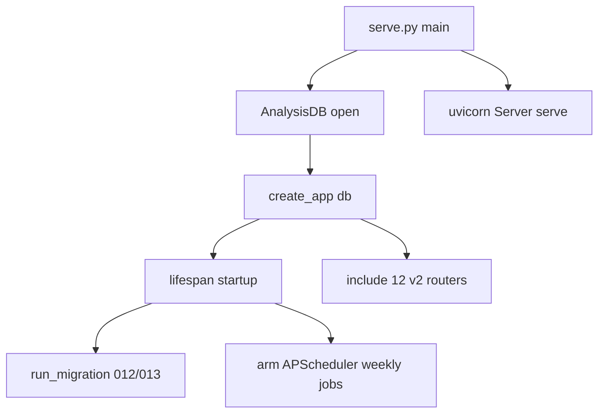

# Optimization lift A/B — `eco-standard-wiki` @ canonical v0.5.0

The **lift** counterpart to the near-ceiling click guarantees run. eco-standard-wiki is a large
real codebase — **1,617 functions/classes, 79 DB tables** — so the canonical skill has genuine
grounding headroom, and per-repo optimization closes it. Generate-mode, `claude-cli` rollout,
deterministic model-free scoring.

| Deterministic axis | Canonical v0.5.0 | Per-repo optimized |
|---|---|---|
| Citation grounding (cited `file:line` resolve) | 87.4% (173/198) | **99.0%** (204/206) |
| ER-diagram grounding (entities vs real tables) | 92.3% | **100%** |
| Analyzed fraction (symbols given real prose analysis) | 10.7% | **27.8%** |
| Malformed-citation rate (lower is better) | 5.1% | **3.4%** |
| Symbol coverage (every function/class accounted) | 100% | 100% |
| Section completeness (all 19 sections) | 100% | 100% |
| Quality score | 98.1% | 98.1% |

Optimizer: **2 of 2 rounds accepted**, final reward **0.820**, citation resolution **97%** on the
held-out scoring slice (99% on the regenerated spec).

**Reading it honestly.** This is a real lift: grounding **+11.7 points** (the optimizer learned,
from eco-wiki's own grounding failures, to cite real filesystem paths), the ER diagram from 92.3%
to **fully grounded** against the 79 real tables, and **2.6× more symbols** given real prose
analysis (`analyzed_fraction` 10.7% → 27.8%). The deterministic guarantees (symbol coverage,
section completeness) were already 100% at baseline and stayed there. The generated spec contains
**two Mermaid `flowchart` traces and one 100%-grounded `erDiagram`** — e.g. the startup trace:



Machine-readable (`name\tpin\tresolved\ttotal\trate\tchecks_pass\tquality_score\tcitation_density\tlabeled_rate\tmalformed_rate\tsection_completeness\tsymbol_coverage\tanalyzed_fraction\tschema_entities\tdiagram_grounding`):

```tsv
eco	93014a973becda3152172cce7ec4cdc2985f3a7d	173	198	0.8737	false	0.9808	4.5000	0.9545	0.0505	1.0000	1.0000	0.1070	79	0.9231
eco	93014a973becda3152172cce7ec4cdc2985f3a7d	204	206	0.9903	false	0.9807	6.4375	0.9375	0.0340	1.0000	1.0000	0.2783	79	1.0000
```

Reproduce:

```sh
python3 -m reposkillopt_engine benchmark --manifest <eco.tsv> --mode generate \
    --skill skills/repo-skillopt/SKILL.md --rollout-provider claude-cli --timeout 1800 --date base
python3 -m reposkillopt_engine optimize-repo /path/to/eco-standard-wiki --skill skills/repo-skillopt/SKILL.md \
    --opt-backend claude-code --rollout-provider claude-cli --rounds 2 --timeout 1800
```
