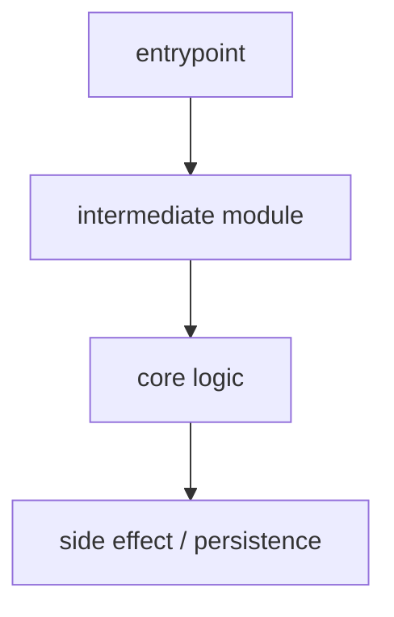
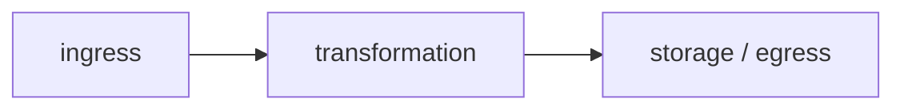

# Repository Specification — <target_repository>

**Target repository**: `<target_repository>` · commit `<target_repository_commit>`  
**Status**: Draft  
**Generated by**: RepoSkillOpt skill v<skill_version> · adapter `<adapter>`  
**Grounding**: every **[fact]** is cited to a real `file:line` — see §19 *Evidence index*. Quality gate: [`repository-specification-checklist.md`](repository-specification-checklist.md).

<!--
Authoring rules (do not delete this comment block; remove the *contents* as you fill the file):

1. Every "major claim" must carry exactly one of the four label prefixes:
     **[fact]**       — verified; MUST be followed by at least one citation
     **[inference]**  — derived from partial signal; state the basis
     **[unknown]**    — explicitly not determined; also list under "Unknowns and unresolved questions"
     **[human]**      — provided by a human; cite the originating Feedback Item id (e.g., FB-2026-05-31-003)

2. Citation forms (after **[fact]** claims):
     `path/to/file.ext:line`               — line number
     `path/to/file.ext:start-end`          — line range
     `path/to/file.ext:Symbol`             — named symbol
     `path/to/file.ext:Symbol:line`        — symbol + line
     `cmd: <command>` + `output: <text>`   — command output

3. Trivial recitations (literal file contents, raw config dumps, syntactic restatements) are not major claims and need no label.

4. All 19 sections below MUST be present in this order, even if empty — write "None known" or "Not applicable" rather than deleting a section.
-->

## 1. Repository overview

<!-- One short paragraph (2–4 sentences). What this repository is, what it does, who uses it. Use **[fact]** with citations to README, package metadata, or descriptive code comments. -->

## 2. Technology stack

<!-- Language(s), framework(s), package manager(s), runtime version(s). Cite manifests (pyproject.toml, package.json, go.mod, pom.xml, etc.). -->

| Component | Choice | Version | Evidence | Label |
|-----------|--------|---------|----------|-------|
| Language | <lang> | <ver> | `path:line` | [fact] |
| Package manager | <tool> | — | `path:line` | [fact] |

## 3. Build and runtime commands

<!-- How to build, test, run. Cite CI configs, Makefiles, scripts/ entries, package.json scripts. -->

## 4. Major entrypoints

<!-- HTTP routes, CLI commands, library public APIs, scheduled jobs, CLI scripts. Cite the file:symbol of each entrypoint. -->

## 5. Architectural layers

<!-- Layer names and responsibilities (e.g., transport / domain / persistence). Cite a representative file per layer. -->

## 6. Core modules

<!-- Module name → one-line purpose. Cite the module path.

  Symbol accounting (no silent omission): every function and class in the repo must be accounted
  for — referenced above, or listed under the subsection below. State the counts.
-->

<!-- If any defined function/class is not discussed above, list them here so nothing is hidden:

### Symbols not yet analyzed

- path/to/file.ext: name1, name2, …   (grouped by file; per-file counts acceptable on large repos)

  Counts: N defined, M analyzed, N−M listed.
-->

## 7. Domain model

<!-- Domain concepts and their relationships. Cite where each concept is defined. -->

## 8. Data model

<!-- Persistent data structures, schemas, table layouts, document shapes. Cite migration files, schema definitions, ORM models, or example documents.

  When the repo has a database/persistent schema, include a grounded ER diagram of the REAL tables
  (key columns + foreign keys), each entity traceable to its schema file. When there is none, write
  "Not applicable" — never a fabricated schema. Example:

  ```mermaid
  erDiagram
    USERS ||--o{ POSTS : authors
    USERS { int id  text email }
    POSTS { int id  int author_id }
  ```
-->

## 9. External integrations

<!-- Third-party services, APIs, libraries with side effects, message brokers. Cite where the integration is invoked. -->

## 10. Control-flow traces

<!-- Lead with a mermaid flowchart of the behavior end to end, then the cited steps beneath.
     The diagram carries no citations; each hop it shows reappears as a labeled, cited line. -->



1. **[fact]** <entrypoint hop> `path:line`.
2. **[fact]** <core-logic hop> `path:line`.

## 11. Data-flow traces

<!-- Lead with a mermaid flowchart of one piece of data: ingress → transformation → storage/egress. -->



1. **[fact]** <ingress hop> `path:line`.
2. **[fact]** <transformation hop> `path:line`.

## 12. Dependency map

<!-- Internal module dependencies; external library dependencies; direct vs transitive. Cite manifest. -->

| Dependency | Kind | Scope / notes | Evidence | Label |
|------------|------|---------------|----------|-------|
| <name> | external / internal | direct / transitive | `path:line` | [fact] |

## 13. Configuration map

<!-- Configurable parameters, where they're declared, their defaults, how they're consumed. -->

| Parameter | Default | Declared in | Consumed at | Evidence | Label |
|-----------|---------|-------------|-------------|----------|-------|
| <name> | <default> | `path` | `path:line` | `path:line` | [fact] |

## 14. Testing strategy

<!-- Test types present (unit / integration / e2e), test runner, coverage posture. Cite test directories and runner config. -->

## 15. Deployment assumptions

<!-- Where this software is expected to run; required environment; secrets handling. Cite deployment files or runbooks if present; mark assumptions explicitly. -->

## 16. Change-impact map

<!-- For one or more anticipated changes: which files/modules would be touched; which tests would need updating. -->

## 17. Known risks

<!-- Repository-specific risks (not generic platitudes). Cite the code or config that motivates each risk. -->

## 18. Unknowns and unresolved questions

<!-- Bullet list of every **[unknown]** claim above, plus any open questions raised during analysis. -->

## 19. Evidence index

<!-- Every distinct citation used in the document, de-duplicated. One row per citation. -->

| Citation | What it supports |
|----------|------------------|
| `path:line` | <claim it grounds> |

<!-- Optional appendix below — only when a revision history exists. -->

## Change log

<!-- One bullet per revision: revision number, ISO date, change summary, Feedback Item ids applied. -->
